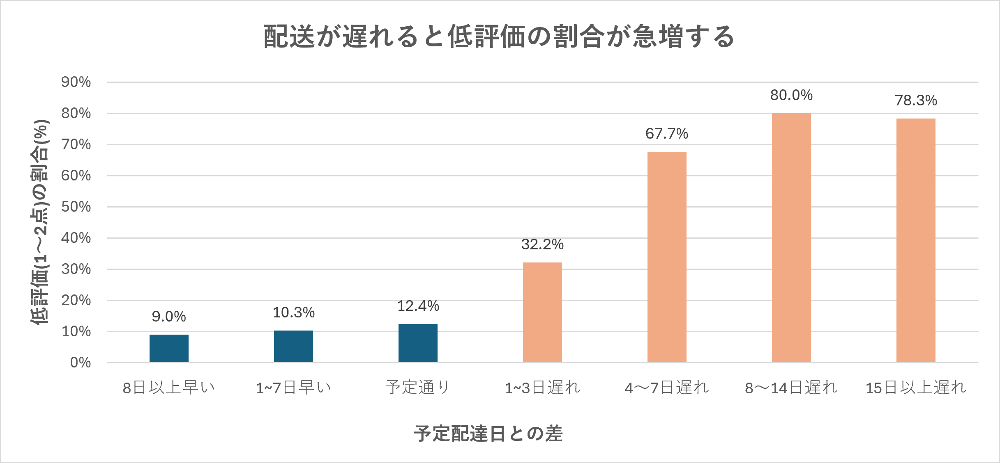

# Data Analysis Portfolio

SQL / BigQueryを使ったデータ分析のポートフォリオです。
公開されている実データをもとに、自分で問いを立て、
「問い → 集計 → 結果の解釈 → 提案」までを一通り行っています。

## Skills

- SQL(BigQuery):JOIN / CTE(WITH) / CASE WHEN / 条件付き集計 / ウィンドウ関数(LAG など)
- Excel:データの読み込み、グラフ作成
- Git / GitHub

---

## 01. 配送遅延とレビュー評価の関係分析

### 目的
配送の遅れが顧客のレビュー評価にどの程度影響するか、
また何日遅れから影響が大きくなるかを調べました。

### 使用データ
ブラジルのECサイトOlistの公開データ(Kaggle)を使用。
- 対象:配達済みの注文 96,353件(レビューと結合後)
- 使用テーブル:orders(注文)、reviews(レビュー)
- [データの入手元(Kaggle)](https://www.kaggle.com/datasets/olistbr/brazilian-ecommerce)

### 分析内容
1. 実際の配達日と予定配達日の差(遅延日数)を算出
2. 「遅れた/遅れていない」の2グループで評価を比較
3. 遅延日数を7グループに分け、評価の変化を確認

### 分析結果

| 遅延グループ | 注文数 | 平均評価 | 低評価割合(1〜2点) |
| --- | --- | --- | --- |
| 8日以上早い | 71,334 | 4.32 | 9.0% |
| 1〜7日早い | 17,319 | 4.20 | 10.3% |
| 予定通り | 1,291 | 4.03 | 12.4% |
| 1〜3日遅れ | 1,856 | 3.29 | 32.2% |
| 4〜7日遅れ | 1,756 |